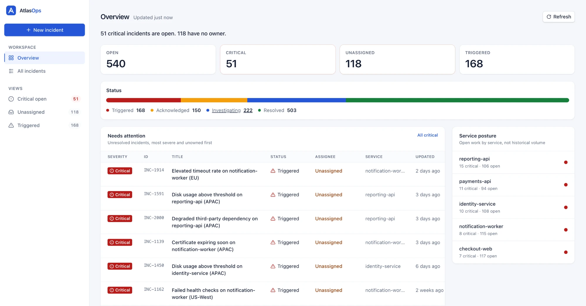

# AtlasOps

**Incident management console for operations teams.** Triage what needs a response, investigate incidents, coordinate ownership and record findings, and keep working when the network is slow, failing or offline.

[](https://github.com/jackobhat6117/Atlasops-Console/actions/workflows/ci.yml)

**Live demo:** [atlasops-console.vercel.app](https://atlasops-console.vercel.app) · **Repository:** [jackobhat6117/Atlasops-Console](https://github.com/jackobhat6117/Atlasops-Console) · **Docs:** [Architecture](docs/ARCHITECTURE.md) · [Decisions](docs/DECISIONS.md) · [Quality](docs/QUALITY.md) · [API](docs/API.md)



### Highlights

- **Triage dashboard:** open, critical and unassigned queues, status mix, attention table and service posture.
- **Incident list for 1,000+ incidents:** debounced search, multi-filters, sorting and pagination, all kept in the URL so views are shareable and survive reload.
- **Incident detail:** optimistic status changes with rollback and conflict detection, assignment, notes, and a server-recorded activity log.
- **Create incident:** inline and summarized validation, live preview, duplicate-submit protection and an unsaved-changes guard.
- **Live and resilient:** change notices from teammates' edits, offline awareness, retries for transient failures, and user-safe error messages.
- **Accessible and themable:** keyboard-first, screen-reader announcements, WCAG AA contrast, and Light / Dark / System themes.

### Quick start

```bash
npm install
npm run dev        # http://localhost:5173
```

No backend or secrets needed. The API runs in the browser.

---

## 1. Overview

**Workflows:**
1. Triage from the dashboard.
2. Search, filter and sort incidents.
3. Inspect an incident's details, notes and activity.
4. Change status and ownership.
5. Add notes.
6. Create incidents.

**Stack:**

| Concern | Choice |
|---|---|
| Framework / build | React 19, TypeScript, Vite |
| Routing and URL state | React Router (data router) |
| Server state | TanStack Query |
| Client state | Zustand (toast queue and theme preference only) |
| Forms and validation | React Hook Form + Zod |
| Accessible primitives | Radix UI (Dialog, DropdownMenu) |
| Styling | Tailwind CSS v4 with semantic design tokens |
| Architecture | Feature-Sliced Design, enforced by ESLint |
| API | Mock Service Worker (deterministic mock) |
| Testing | Vitest, React Testing Library, user-event, jest-axe |

## 2. Setup

Requires Node.js 20+ (developed on 22) and npm 10+.

```bash
npm install          # install
npm run dev          # development server
npm test             # tests (npm run test:watch for watch mode)
npm run build        # production build (type-checks first)
npm run preview      # serve the production build
npm run lint         # lint, including architecture boundaries
npm run size         # bundle-size budgets (after a build)
```

CI runs lint, type-check, tests, build and the bundle budgets on every push and pull request.

**Environment variables** (optional; copy `.env.example` to `.env.local`):

| Variable | Default | Purpose |
|---|---|---|
| `VITE_MOCK_FAILURE_RATE` | `0.05` | Chance (0–1) that a mock request fails with a 500. `0` for a failure-free demo. |
| `VITE_MOCK_LIVE_UPDATES` | `true` | Simulated teammates edit open incidents so live updates are visible. |

**Mock API:**
- Served by Mock Service Worker: 1,043 seeded incidents, 200–1,200 ms latency, and occasional failures.
- Development-only `X-Mock-*` headers can force errors, delays and conflicts.
- Where service workers are blocked, an in-page fallback runs the same handlers.
- Reference: [docs/API.md](docs/API.md).

**Deployment:** a static site on Vercel (`npm run build` → `dist`). `vercel.json` rewrites unknown paths to `index.html`, so deep links work on refresh. Any static host works with an equivalent SPA fallback.

## 3. Architecture

```text
Route → Page → Widget → Feature hook → Entity API → request() → MSW
```

- **Structure:** Feature-Sliced Design layers (`app → pages → widgets → features → entities → shared`). Each slice exposes a public `index.ts`, and ESLint rejects upward or deep imports.
- **Data fetching:** `request()` validates every response with Zod, times out after 10 s, and maps every failure to a typed `ApiError`. TanStack Query caches with hierarchical keys, deduplicates, cancels stale requests and retries only transient failures.
- **State ownership:** server data → TanStack Query; list state → the URL; forms → React Hook Form; UI state → `useState`; toasts and theme → Zustand.
- **URL state:** one sanitizer, shared with the mock API. It drops invalid values and produces a canonical query string that doubles as the cache key.
- **Forms:** React Hook Form + Zod (the same schemas as the API). Errors are shown inline and summarized, server field errors map onto fields, double submits are blocked, and an unsaved-changes guard protects input.
- **Error handling:** user-safe messages written on the client, never server text. Route-level error boundaries keep crashes inside the app shell.
- **Styling:** semantic tokens in one CSS file. Light and dark themes are two sets of values, contrast-checked to WCAG AA.

Full details: **[docs/ARCHITECTURE.md](docs/ARCHITECTURE.md)**.

## 4. Important Decisions

1. **MSW instead of a hosted backend:** one API contract for the browser, the demo and the tests.
2. **TanStack Query and the URL hold almost all state;** Zustand holds only toasts and theme.
3. **Feature-Sliced Design, enforced by lint** rather than by convention.
4. **One URL parser shared by the UI and the mock,** so they can never disagree.
5. **Table on desktop, cards on phones,** with only one layout mounted.
6. **Optimistic status changes with versioned conflict detection;** everything else waits for the server.
7. **A server-recorded activity log,** consistent across users like a real audit trail.
8. **Real-time by polling and a "changed — Refresh" notice,** never rows moving under the cursor.
9. **Offline: reads pause, writes fail fast,** never silently queued.

The reasoning and trade-offs for each: **[docs/DECISIONS.md](docs/DECISIONS.md)**.

## 5. Performance

- **Dataset:** 1,043 incidents. Only the requested page is fetched and rendered (25 rows by default).
- **Optimizations:** request cancellation and deduplication, 30 s caching, memoized rows, a single responsive layout, route-level code splitting, and a CSS-only dashboard with no chart library.
- **Intentionally avoided:** virtualization (unnecessary at 25 rows) and memoization without measured evidence.
- **Budgets enforced in CI (gzip):** initial JS 176 kB / 200 kB, CSS 7.9 kB / 12 kB, largest route chunk 13 kB / 16 kB.

Details and measurements: **[docs/QUALITY.md](docs/QUALITY.md#performance)**.

## 6. Accessibility

- **Keyboard:** fully operable, with a skip link, arrow-key row navigation and visible focus everywhere, including inside menus.
- **Focus:** pages focus their heading, the dialog traps and returns focus, and returning from an incident focuses its row.
- **Forms and status:** errors are linked to fields, summarized, and focus the first invalid field. Status and severity never rely on color alone.
- **Announcements:** results, mutation outcomes and change notices are announced through always-mounted live regions.
- **Verified by:** jest-axe in every page test plus a 24-scan sweep (3 widths, dark theme, menus, dialog, error states), numeric WCAG AA contrast checks of the theme tokens, and manual keyboard passes.

Details and limitations: **[docs/QUALITY.md](docs/QUALITY.md#accessibility)**.

## 7. Testing

- **Approach:** mostly page-level integration tests that render the real routes against the real mock API and interact like a user. Unit tests cover pure logic.
- **Coverage:** 132 tests, including every required behavior: list rendering, search and filtering, successful and failed mutations with rollback, form validation, and keyboard and dialog focus.
- **Not covered:** cross-browser visual regression and end-to-end tests against a deployed backend.

Details: **[docs/QUALITY.md](docs/QUALITY.md#testing)**.

## 8. Incomplete work and roadmap

**Known limitations:**
- Data is in-memory and resets on reload.
- Authentication and authorization are out of scope.
- Live updates use polling; the optional Server-Sent Events endpoint is not implemented.
- Dashboard figures are snapshots, because the model has no historical time series.
- Opening an incident directly from a shared link falls back to the default list on return.
- No formal screen-reader QA pass yet.

**Known bugs:** none known.

**Next:**
1. Playwright smoke tests in CI against the deployed build.
2. Server-Sent Events when a real backend exists.
3. Persist the return-to-list context in the URL.
4. Historical incident trends.

## License and assets

No third-party assets are included. The logo and favicon are original. Third-party code is used only as npm dependencies, under their own licenses.
